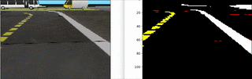

# Semantic segmentation transfer

This documentation is split into two sections, a demo section that has all the information to showcase our pre-trained models and a training section where more information to reproduce our results can be found.

---

## Line segmentation from video file

We provide two ways of segmenting a video file coming from the duckiebot log database.  Any video file from the duckietown logs database can be used for the demo. When launching any of them, our pre-trained models will be downloaded automatically and a `.gif` will be created after processing the images.

For more information as to how to get a video file from the duckietown database and to see which ones were used to train our models, see the [this section](#real-duckiebot-images).

 **Please ensure you have the necessary dependencies installed before launching the demo, see [this section](#environment) for more information**.

*WARNING: The processing can take some time, especially if not using a GPU and the video file is large. By default, we keep a high framerate to have smooth video while limiting the length of the input video to about 3 minutes. These can be changed in the source code, if necessary.*

#### Video transformed into simulator pixel space

This is a demo where the image is brought back to the full simulator pixel space before applying our line segmentation model. While this method is useful to see the transformed version of the real image into the simulator pixel space, performance is noticeably worst.

To process a video use the `make gif-transformed` recipe. For example,

```
make gif-transformed input_file=duckie_video.mp4 output_file=duckie_transformed.gif
```


#### Video compressed into embedding space

This is a demo where the image is directly segmented without being explicitly transformed to the full simulator pixel space. While this method offers less interpretability, performance is noticeably better.

To process a video use the `make gif-embedding` recipe. For example,
```
make gif-embedding input_file=duckie_video.mp4 output_file=duckie_embedding.gif
```

*ADD EMBEDDING GIF HERE*
``

## Running the segmentation demo on the duckietown simulator

We provide a tool to test our pre-trained segmentation network live on the simulator while the user can manually control the agent. In order to run the simulation, simply run `$ python src/results/seg_control.py`.

**Please ensure you have the necessary dependencies installed before launching the demo, see [this section](#environment) for more information**.



*WARNING: We tested the live demo on OSX. It might possibly not work on Linux out of the box.*

---

# Training

To launch any `make` recipe with reference to local directories (`./data` and `./models`), pass any value to the variable `local` other than `false`. For example,

```
make models/segnet.pth local=1
make models/segnet.pth local=true
```
The above will run with the local subdirectories as reference.

The default is to point to the Mila file system for data and models. See [the makefile](makefile) for more info.

*N.B. This is not required for the demo, where everything is done locally.*

## Environment

Dependencies are listed in [`environment.yml`](environment.yml). To create the conda environment, use the following command.

```
conda env create -f environment.yml
```

Please note for the live demo of line segmentation in the simulator with manual control, you need have the duckietown simulator installed (instruction here: https://github.com/duckietown/simulator).

## Data

Data files `classes.hdf5`, `sim.hdf5` and `real.hdf5` must be placed in `hdf5`

The distributions of the classes are the following
```
('Valid set: ', {black: 17157, white: 1596, red: 138, yellow: 307})
('train set: ', {black: 17154, white: 1602, red: 137, yellow: 304})
```

Class 0: Black
Class 1: White
Class 2: Red
Class 3: Yellow

### Adjusted weights in loss

Given our dataset is highly unbalanced (a lot more black pixels), we add an importance factor to the loss for each class which is inversly proportional to the number of pixels. I.e., reduce the importance of predicting correctly black pixels, and increase the importance of predicting the yellow pixels.

To compute the weights, we use the average number of pixels per image in the training set as mentionned above.


| Pixel color  | % | ideal % | adjusted class weight |
| ------------ | - | ------- | ------ |
| Black | 89.4 % | 25 % | 0.51% |
| White | 8.3 % | 25 % | 5.51% |
| Red | 0.7 % | 25 % | 65.38% |
| Yellow | 1.6% | 25 % | 28.60% |

### Real Duckiebot images

The database of logs can be found [here](http://ipfs.duckietown.org:8080/ipfs/QmUbtwQ3QZKmmz5qTjKM3z8LJjsrKBWLUnnzoE5L4M7y7J/logs/gallery.html). Files can be directly downloaded from [here](https://gateway.ipfs.io/ipfs/QmUbtwQ3QZKmmz5qTjKM3z8LJjsrKBWLUnnzoE5L4M7y7J/logs/) using the following command.

```
make data/videos/download.info
```

A list of videos used is listed in the file [`data/videos/list_of_videos.txt`](data/videos/list_of_videos.txt).

#### Extracting frames

Frames were extracted from the raw videos from the logs and downsampled from 640x480 to 160x120. Extracting every 10 frames of the downloaded videos provided a dataset of 11419 images.

To extract the frames from the set of downloaded videos, simply use the following command.

```
make data/videos/real.npy
```

### Tiny dataset

The code can run on tiny versions of the datasets using the following command.

```
make tiny-segnet
```

 See [the makefile](makefile) for more info. Please be aware the tiny versions of the dataset can be made using [this file](src/data/tiny_dataset.py).


 ### Visualisation

 It is possible, but no necessary, to monitor the training using Visdom. In order to use Visdom, as server must be running a priori.

 #### Launching a server
 The instructions to launch a server are well documented [here](https://github.com/facebookresearch/visdom#usage)

 Launching a Visdom server on the MILA cluster is a bit more involved. A script is provided in `./scripts/start_visdom.sh`
 You need to define a $PORT that you are the only one using and choose a machine acting as $SERVER.

 ##### Step 1
 On your local machine, add the following to the file `~/.ssh/config`
 ```
 Host elisa1.iro.umontreal.ca
 User $MILAUSER
 LocalForward $PORT 127.0.0.1:$PORT
 ```

 ##### Step 2
 ssh to elisa1.

 ##### Step 3
 Launch the provided script on a $SERVER.
 ```
 sbatch -w $SERVER --mem=8000 ./scripts/start_visdom.sh $PORT
 ```
 Fineprint: You need to have visdom installed. You can add a line in the script that activate a conda environment that have visdom.

 ##### Step 4
 Enjoy your visdom server in the browser at the address `http://localhost:$PORT`.
 Fineprint: You have to be connected throught ssh on elisa1 in order see your visdom server on your local machine.

 ### Using the server
 Now that you have a server running, you may want to use it in your training script.
 To do so, add the following options when launching the training script: `--server http://$SERVER`, `--port $PORT`
